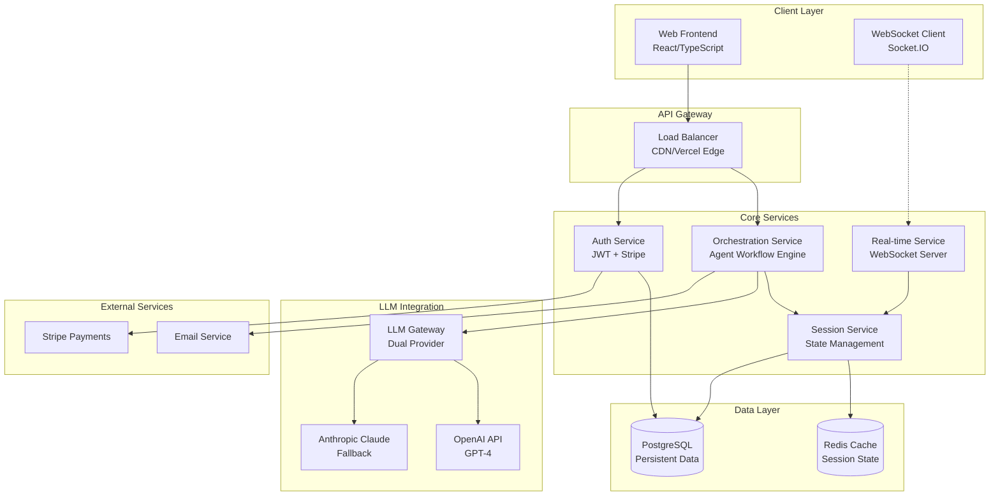
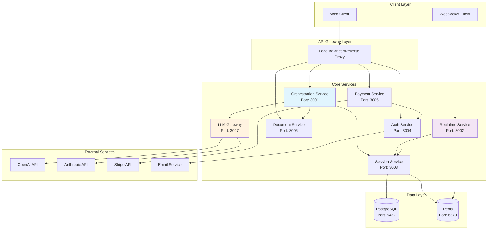
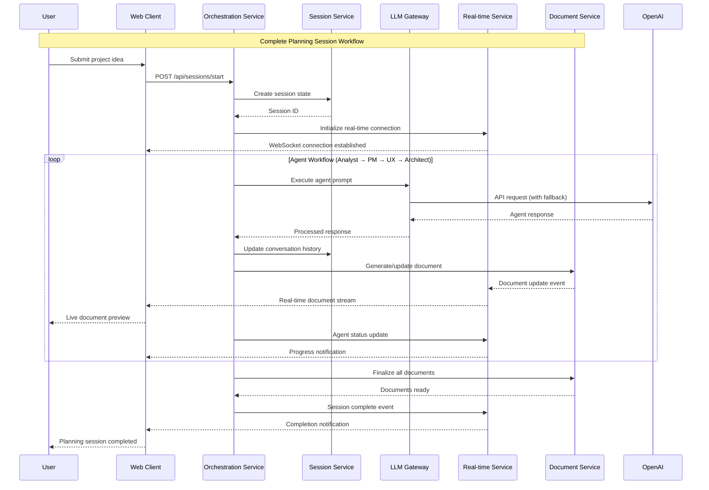
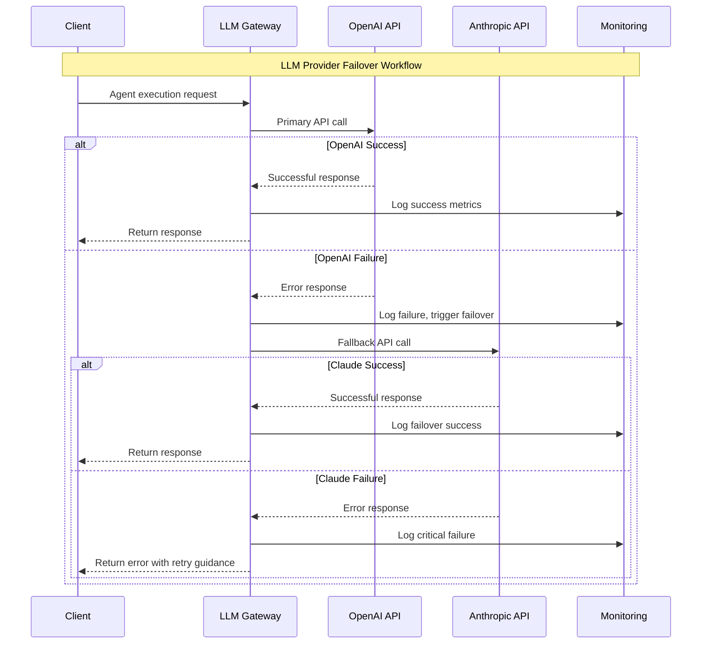

# BMAD Web UI Platform Architecture Document

## Introduction

This document outlines the overall project architecture for BMAD Web UI Platform, including backend systems, shared services, and non-UI specific concerns. Its primary goal is to serve as the guiding architectural blueprint for AI-driven development, ensuring consistency and adherence to chosen patterns and technologies.

**Relationship to Frontend Architecture:**
If the project includes a significant user interface, a separate Frontend Architecture Document will detail the frontend-specific design and MUST be used in conjunction with this document. Core technology stack choices documented herein (see "Tech Stack") are definitive for the entire project, including any frontend components.

### Starter Template or Existing Project

**Decision:** Hybrid approach using proven starters for standard components (authentication, API structure) while building custom orchestration engine.

**Rationale:** The BMAD orchestration engine requires unique implementation for agent workflow management, but leveraging existing patterns for authentication and payment processing will accelerate development while maintaining reliability.

### Change Log

| Date | Version | Description | Author |
|------|---------|-------------|---------|
| 2025-09-08 | v1.0 | Initial architecture creation | Winston (Architect) |

## High Level Architecture

### Technical Summary

The BMAD Web UI Platform employs a hybrid microservices architecture optimized for real-time AI orchestration and document streaming. The system centers around an orchestration engine that manages BMAD agent workflows (analyst → PM → UX expert → architect) while providing WebSocket-powered real-time updates to users. Core technology stack leverages Node.js/Express for familiar development patterns, PostgreSQL for persistent data with Redis for session caching, and dual LLM provider integration (OpenAI/Anthropic) with automatic failover. The architecture directly supports PRD goals of 45-minute comprehensive planning sessions, 1,000 concurrent users, and seamless freemium monetization through progressive disclosure patterns.

### High Level Overview

**Main Architectural Style:** Hybrid Microservices with Event-Driven Communication
- Core orchestration service manages agent workflows and session state
- Real-time streaming service handles WebSocket connections and document updates  
- Authentication/billing services operate as independent microservices
- Shared database layer with service-specific schemas

**Repository Structure:** Monorepo (as specified in PRD)
- Enables shared types between frontend/backend while maintaining clear service boundaries
- Facilitates coordinated deployment of real-time features requiring frontend/backend synchronization

**Service Architecture:** Orchestrated Microservices
- **Orchestration Service:** Central workflow engine managing BMAD agent execution
- **Real-time Service:** WebSocket server for document streaming and progress updates
- **Session Service:** State management via Redis cache with PostgreSQL persistence  
- **LLM Gateway Service:** Dual provider management with failover logic

**Primary Data Flow:**
User Input → Orchestration Engine → Agent Execution → Document Generation → Real-time Streaming → Client Updates

**Key Architectural Decisions:**
- **Event-driven agent handoffs** enable seamless transitions without blocking user experience
- **Separate real-time service** ensures WebSocket performance isolation from orchestration logic
- **Dual LLM provider architecture** guarantees 99.9% uptime requirement through automatic failover
- **Redis session caching** supports the 45-minute session duration with PostgreSQL backup for persistence

### High Level Project Diagram



### Architectural and Design Patterns

- **Orchestrator Pattern:** Central orchestration service manages complex BMAD agent workflows with state transitions - Essential for managing analyst→PM→UX→architect handoffs while maintaining conversation context and ensuring reliable session completion

- **Event-Driven Architecture:** Services communicate via events for loose coupling, using message queues for async processing - Supports real-time document updates, agent handoffs, and system resilience required for 45-minute sessions with 99.9% uptime

- **Gateway Pattern for LLM Integration:** Dedicated service handling dual OpenAI/Anthropic integration with automatic failover - Abstracts LLM complexity, enables seamless provider switching, and centralizes cost/usage monitoring critical for business model

- **Repository Pattern with Unit of Work:** Abstract data access with transactional integrity across session management operations - Ensures session state consistency during complex agent transitions and supports conversation history management within token limits

- **Circuit Breaker Pattern:** Prevent cascading failures in LLM API calls with automatic recovery - Maintains service availability when external providers fail, critical for user experience and revenue protection

## Tech Stack

### Cloud Infrastructure
- **Provider:** Multi-cloud (Vercel + Railway/AWS)
- **Key Services:** 
  - Vercel for frontend CDN and edge functions
  - Railway for backend services (development simplicity)
  - AWS SQS/SNS for production message queuing
  - AWS RDS PostgreSQL for managed database
- **Deployment Regions:** US-East (primary), US-West (secondary)

### Technology Stack Table

| Category | Technology | Version | Purpose | Rationale |
|----------|------------|---------|---------|-----------|
| **Language** | TypeScript | 5.3.3 | Primary development language | Strong typing prevents runtime errors in complex orchestration logic, excellent LLM SDK support |
| **Runtime** | Node.js | 20.11.0 LTS | JavaScript runtime | LTS stability, excellent async performance for real-time features, team expertise |
| **Framework** | Express.js | 4.18.2 | Backend API framework | Lightweight, mature ecosystem, Socket.IO integration, suitable for microservices |
| **Database** | PostgreSQL | 15.4 | Primary data store | ACID compliance for session integrity, JSON support for flexible schemas, Prisma compatibility |
| **ORM** | Prisma | 5.7.1 | Database abstraction | Type-safe queries, excellent migration system, perfect TypeScript integration |
| **Caching** | Redis | 7.2 | Session state and caching | In-memory performance for 45-minute sessions, pub/sub for real-time features |
| **Real-time** | Socket.IO | 4.7.4 | WebSocket communication | Automatic fallback support, room management, excellent Node.js integration |
| **Message Queue** | Bull Queue | 4.12.2 | Background job processing | Redis-based, perfect for orchestrating agent workflows, retry logic |
| **LLM Primary** | OpenAI SDK | 4.26.0 | GPT-4 integration | Most reliable provider, excellent documentation, proven performance |
| **LLM Fallback** | Anthropic SDK | 0.12.0 | Claude integration | Backup provider for 99.9% uptime, different capabilities for edge cases |
| **Authentication** | JWT + Passport | 0.7.0 / 0.6.0 | User authentication | Stateless tokens, mature ecosystem, Stripe integration ready |
| **Payments** | Stripe Node SDK | 14.12.0 | Payment processing | Industry standard, comprehensive billing features, webhook support |
| **Validation** | Zod | 3.22.4 | Runtime type validation | TypeScript-first, perfect for API validation, LLM response parsing |
| **Testing** | Jest + Supertest | 29.7.0 / 6.3.3 | Unit and integration testing | Mature ecosystem, excellent mocking, API testing capabilities |
| **Monitoring** | Winston + Sentry | 3.11.0 / 7.81.1 | Logging and error tracking | Production-ready logging, comprehensive error monitoring |
| **Process Management** | PM2 | 5.3.0 | Production process management | Zero-downtime deployment, clustering, monitoring |

## Data Models

### User
**Purpose:** Represents platform users with authentication, subscription, and session management

**Key Attributes:**
- id: UUID - Unique identifier
- email: String - Primary authentication credential  
- password_hash: String - Secure password storage
- subscription_tier: Enum - FREE, EMAIL_CAPTURED, PREMIUM
- stripe_customer_id: String? - Payment integration reference
- created_at: DateTime - Account creation timestamp
- last_login: DateTime? - Session tracking
- preferences: JSON - User planning preferences and history

**Relationships:**
- Has many PlanningSession entities
- Has many Document entities through sessions
- Has one UserProfile entity

### PlanningSession
**Purpose:** Core entity representing a complete planning workflow execution from input to deliverables

**Key Attributes:**
- id: UUID - Unique session identifier
- user_id: UUID? - Owner reference (null for anonymous)
- status: Enum - ACTIVE, PAUSED, COMPLETED, FAILED
- current_agent: Enum - ANALYST, PM, UX_EXPERT, ARCHITECT
- project_input: Text - Initial user project description
- session_data: JSONB - Complete conversation history and context
- progress_percentage: Integer - Session completion tracking
- started_at: DateTime - Session initiation time
- completed_at: DateTime? - Session completion timestamp
- expires_at: DateTime - Session timeout management

**Relationships:**
- Belongs to User (optional for anonymous sessions)
- Has many ConversationMessage entities
- Has many Document entities
- Has many AgentExecution entities

### ConversationMessage
**Purpose:** Individual messages in the planning conversation, supporting context management and session resume

**Key Attributes:**
- id: UUID - Message identifier
- session_id: UUID - Parent session reference
- agent_type: Enum - ANALYST, PM, UX_EXPERT, ARCHITECT, USER
- content: Text - Message content
- metadata: JSONB - Agent context, timestamps, processing info
- sequence_number: Integer - Message ordering within session
- created_at: DateTime - Message timestamp

**Relationships:**
- Belongs to PlanningSession
- May reference previous ConversationMessage (threading)

### AgentExecution
**Purpose:** Tracks individual agent workflow executions for monitoring and debugging

**Key Attributes:**
- id: UUID - Execution identifier  
- session_id: UUID - Parent session reference
- agent_type: Enum - ANALYST, PM, UX_EXPERT, ARCHITECT
- status: Enum - PENDING, EXECUTING, COMPLETED, FAILED
- input_context: JSONB - Agent input parameters and context
- output_data: JSONB - Agent execution results
- llm_provider: Enum - OPENAI, ANTHROPIC
- token_usage: Integer - Cost tracking
- execution_time_ms: Integer - Performance monitoring
- error_message: String? - Failure debugging
- started_at: DateTime - Execution start time
- completed_at: DateTime? - Execution completion time

**Relationships:**
- Belongs to PlanningSession
- May have many LLMRequest entities for complex executions

### Document
**Purpose:** Generated planning documents (PRD, Architecture, etc.) with versioning and export capabilities

**Key Attributes:**
- id: UUID - Document identifier
- session_id: UUID - Source session reference
- document_type: Enum - PROJECT_BRIEF, PRD, ARCHITECTURE, USER_STORIES
- title: String - Document title
- content: Text - Markdown document content
- version: Integer - Document version tracking
- status: Enum - DRAFT, GENERATING, COMPLETED
- export_formats: JSON - Available export format metadata
- created_at: DateTime - Document creation time
- updated_at: DateTime - Last modification time

**Relationships:**
- Belongs to PlanningSession
- May have many DocumentExport entities

### LLMRequest
**Purpose:** Tracks individual LLM API calls for monitoring, debugging, and cost management

**Key Attributes:**
- id: UUID - Request identifier
- agent_execution_id: UUID? - Parent execution reference
- provider: Enum - OPENAI, ANTHROPIC
- model: String - Specific model used (gpt-4, claude-3, etc.)
- prompt: Text - Input prompt sent to LLM
- response: Text - LLM response content
- token_count_input: Integer - Input token usage
- token_count_output: Integer - Output token usage
- cost_usd: Decimal - Request cost tracking
- response_time_ms: Integer - Performance monitoring
- status: Enum - SUCCESS, FAILED, TIMEOUT
- error_code: String? - Failure classification
- created_at: DateTime - Request timestamp

**Relationships:**
- May belong to AgentExecution
- Enables cost tracking and performance analysis

## Components

### Orchestration Service
**Responsibility:** Central workflow engine managing BMAD agent execution sequences and session state transitions

**Key Interfaces:**
- `/api/sessions` - Session lifecycle management (create, resume, complete)
- `/api/agents/execute` - Agent workflow triggering and monitoring
- `/internal/workflow-state` - Internal state management API

**Dependencies:** Session Service, LLM Gateway Service, Document Generation Service

**Technology Stack:** Express.js REST API, Bull Queue for workflow management, Prisma for data access

### Real-time Streaming Service  
**Responsibility:** WebSocket server providing live document updates and progress notifications to connected clients

**Key Interfaces:**
- WebSocket `/ws/sessions/{sessionId}` - Real-time session connection
- Events: `document_updated`, `agent_status_changed`, `progress_updated`
- `/internal/broadcast` - Internal message broadcasting API

**Dependencies:** Session Service, Redis pub/sub for message distribution

**Technology Stack:** Socket.IO server, Redis adapter for horizontal scaling, Express.js health endpoints

### Session Management Service
**Responsibility:** Session state persistence, conversation history management, and session lifecycle coordination

**Key Interfaces:**
- `/api/sessions/{id}/state` - Session state CRUD operations
- `/api/sessions/{id}/messages` - Conversation history management  
- `/internal/session-cache` - Redis cache operations

**Dependencies:** PostgreSQL (persistent storage), Redis (performance cache)

**Technology Stack:** Express.js API, Prisma ORM, Redis client, session expiration handling

### LLM Gateway Service
**Responsibility:** Dual provider LLM integration with automatic failover, cost tracking, and response optimization

**Key Interfaces:**
- `/internal/llm/complete` - Text completion with provider failover
- `/internal/llm/status` - Provider health and availability checking
- `/internal/llm/usage` - Token usage and cost reporting

**Dependencies:** OpenAI API, Anthropic Claude API, monitoring service

**Technology Stack:** Express.js internal API, OpenAI SDK, Anthropic SDK, circuit breaker pattern implementation

### Authentication & Authorization Service
**Responsibility:** User authentication, JWT token management, subscription tier enforcement, and premium feature gating

**Key Interfaces:**
- `/auth/register` - User registration with email validation
- `/auth/login` - Authentication with JWT token generation
- `/auth/validate` - Token validation middleware for protected routes
- `/internal/permissions` - Subscription tier and feature access checking

**Dependencies:** PostgreSQL user data, Stripe payment integration, email service

**Technology Stack:** Express.js REST API, Passport.js authentication, JWT token management, bcrypt password hashing

### Payment & Subscription Service
**Responsibility:** Stripe payment processing, subscription management, billing automation, and usage tracking

**Key Interfaces:**
- `/api/payments/subscribe` - Subscription creation and management
- `/api/payments/webhook` - Stripe webhook handling
- `/internal/billing/check-limits` - Usage limit enforcement

**Dependencies:** Stripe API, user authentication, email service for billing notifications

**Technology Stack:** Express.js API, Stripe Node SDK, webhook signature verification, automated billing logic

### Document Generation Service
**Responsibility:** BMAD template processing, document compilation from conversation data, and export format generation

**Key Interfaces:**
- `/internal/documents/generate` - Document creation from session data
- `/api/documents/{id}/export` - Multi-format document export (PDF, Word, Markdown)
- `/internal/templates` - BMAD template management and processing

**Dependencies:** Session data, BMAD template library, file storage service

**Technology Stack:** Express.js API, template engine (Handlebars), PDF generation (Puppeteer), document formatting libraries

### Component Diagrams



## External APIs

### OpenAI API
- **Purpose:** Primary LLM provider for BMAD agent execution and document generation
- **Documentation:** https://platform.openai.com/docs/api-reference
- **Base URL(s):** https://api.openai.com/v1
- **Authentication:** Bearer token authentication with API key
- **Rate Limits:** 10,000 requests/minute (Tier 4), 3,500,000 tokens/minute

**Key Endpoints Used:**
- `POST /chat/completions` - Agent conversation execution with GPT-4
- `GET /models` - Available model validation and capability checking

**Integration Notes:** Primary provider with circuit breaker pattern, comprehensive error handling for rate limits, token usage tracking for cost management

### Anthropic Claude API
- **Purpose:** Fallback LLM provider ensuring 99.9% uptime requirement through automatic provider switching
- **Documentation:** https://docs.anthropic.com/claude/reference/
- **Base URL(s):** https://api.anthropic.com/v1
- **Authentication:** x-api-key header authentication
- **Rate Limits:** 5,000 requests/minute, 2,000,000 tokens/minute

**Key Endpoints Used:**
- `POST /messages` - Agent execution fallback with Claude-3
- `GET /` - Health check and service availability validation

**Integration Notes:** Automatic failover logic when OpenAI unavailable, prompt format translation between providers, cost comparison tracking

### Stripe Payment API
- **Purpose:** Payment processing, subscription management, and billing automation for freemium monetization
- **Documentation:** https://stripe.com/docs/api
- **Base URL(s):** https://api.stripe.com/v1
- **Authentication:** Bearer token with secret key
- **Rate Limits:** 1,000 requests/second

**Key Endpoints Used:**
- `POST /customers` - Customer creation for subscription management
- `POST /subscriptions` - Subscription lifecycle management
- `POST /webhook-endpoints` - Billing event processing

**Integration Notes:** Webhook signature verification for security, idempotent payment processing, automated dunning management

## Core Workflows





## REST API Spec

```yaml
openapi: 3.0.0
info:
  title: BMAD Web UI Platform API
  version: 1.0.0
  description: Backend API for AI-powered project planning orchestration
servers:
  - url: https://api.bmadkit.com/v1
    description: Production API server
  - url: https://staging-api.bmadkit.com/v1
    description: Staging API server

paths:
  /sessions:
    post:
      summary: Start new planning session
      requestBody:
        required: true
        content:
          application/json:
            schema:
              type: object
              properties:
                project_input:
                  type: string
                  description: Initial project description
                user_preferences:
                  type: object
                  description: Optional user preferences
      responses:
        201:
          description: Session created successfully
          content:
            application/json:
              schema:
                $ref: '#/components/schemas/SessionResponse'

  /sessions/{sessionId}/messages:
    post:
      summary: Send message to agent
      parameters:
        - name: sessionId
          in: path
          required: true
          schema:
            type: string
            format: uuid
      requestBody:
        required: true
        content:
          application/json:
            schema:
              type: object
              properties:
                content:
                  type: string
                agent_context:
                  type: object
      responses:
        200:
          description: Message processed
          content:
            application/json:
              schema:
                $ref: '#/components/schemas/MessageResponse'

  /documents/{documentId}/export:
    get:
      summary: Export document in specified format
      parameters:
        - name: documentId
          in: path
          required: true
          schema:
            type: string
            format: uuid
        - name: format
          in: query
          required: true
          schema:
            type: string
            enum: [markdown, pdf, docx, json]
      responses:
        200:
          description: Document export successful
          content:
            application/octet-stream:
              schema:
                type: string
                format: binary

components:
  schemas:
    SessionResponse:
      type: object
      properties:
        id:
          type: string
          format: uuid
        status:
          type: string
          enum: [active, paused, completed, failed]
        current_agent:
          type: string
          enum: [analyst, pm, ux_expert, architect]
        websocket_url:
          type: string
        expires_at:
          type: string
          format: date-time

    MessageResponse:
      type: object
      properties:
        id:
          type: string
          format: uuid
        agent_response:
          type: string
        next_questions:
          type: array
          items:
            type: string
        document_updates:
          type: array
          items:
            $ref: '#/components/schemas/DocumentUpdate'

    DocumentUpdate:
      type: object
      properties:
        document_id:
          type: string
          format: uuid
        document_type:
          type: string
        updated_content:
          type: string
        version:
          type: integer

  securitySchemes:
    BearerAuth:
      type: http
      scheme: bearer
      bearerFormat: JWT

security:
  - BearerAuth: []
```

## Database Schema

```sql
-- Core user management
CREATE TABLE users (
    id UUID PRIMARY KEY DEFAULT gen_random_uuid(),
    email VARCHAR(255) UNIQUE NOT NULL,
    password_hash VARCHAR(255) NOT NULL,
    subscription_tier VARCHAR(20) DEFAULT 'FREE' CHECK (subscription_tier IN ('FREE', 'EMAIL_CAPTURED', 'PREMIUM')),
    stripe_customer_id VARCHAR(255),
    preferences JSONB DEFAULT '{}',
    created_at TIMESTAMP DEFAULT CURRENT_TIMESTAMP,
    last_login TIMESTAMP,
    INDEX idx_users_email (email),
    INDEX idx_users_subscription (subscription_tier)
);

-- Planning session management
CREATE TABLE planning_sessions (
    id UUID PRIMARY KEY DEFAULT gen_random_uuid(),
    user_id UUID REFERENCES users(id) ON DELETE SET NULL,
    status VARCHAR(20) DEFAULT 'ACTIVE' CHECK (status IN ('ACTIVE', 'PAUSED', 'COMPLETED', 'FAILED')),
    current_agent VARCHAR(20) DEFAULT 'ANALYST' CHECK (current_agent IN ('ANALYST', 'PM', 'UX_EXPERT', 'ARCHITECT')),
    project_input TEXT NOT NULL,
    session_data JSONB DEFAULT '{}',
    progress_percentage INTEGER DEFAULT 0 CHECK (progress_percentage >= 0 AND progress_percentage <= 100),
    started_at TIMESTAMP DEFAULT CURRENT_TIMESTAMP,
    completed_at TIMESTAMP,
    expires_at TIMESTAMP DEFAULT (CURRENT_TIMESTAMP + INTERVAL '48 hours'),
    INDEX idx_sessions_user (user_id),
    INDEX idx_sessions_status (status),
    INDEX idx_sessions_expires (expires_at)
);

-- Conversation history
CREATE TABLE conversation_messages (
    id UUID PRIMARY KEY DEFAULT gen_random_uuid(),
    session_id UUID NOT NULL REFERENCES planning_sessions(id) ON DELETE CASCADE,
    agent_type VARCHAR(20) NOT NULL CHECK (agent_type IN ('ANALYST', 'PM', 'UX_EXPERT', 'ARCHITECT', 'USER')),
    content TEXT NOT NULL,
    metadata JSONB DEFAULT '{}',
    sequence_number INTEGER NOT NULL,
    created_at TIMESTAMP DEFAULT CURRENT_TIMESTAMP,
    INDEX idx_messages_session (session_id),
    INDEX idx_messages_sequence (session_id, sequence_number),
    UNIQUE(session_id, sequence_number)
);

-- Agent execution tracking
CREATE TABLE agent_executions (
    id UUID PRIMARY KEY DEFAULT gen_random_uuid(),
    session_id UUID NOT NULL REFERENCES planning_sessions(id) ON DELETE CASCADE,
    agent_type VARCHAR(20) NOT NULL,
    status VARCHAR(20) DEFAULT 'PENDING' CHECK (status IN ('PENDING', 'EXECUTING', 'COMPLETED', 'FAILED')),
    input_context JSONB DEFAULT '{}',
    output_data JSONB DEFAULT '{}',
    llm_provider VARCHAR(20) CHECK (llm_provider IN ('OPENAI', 'ANTHROPIC')),
    token_usage INTEGER DEFAULT 0,
    execution_time_ms INTEGER,
    error_message TEXT,
    started_at TIMESTAMP DEFAULT CURRENT_TIMESTAMP,
    completed_at TIMESTAMP,
    INDEX idx_executions_session (session_id),
    INDEX idx_executions_status (status),
    INDEX idx_executions_provider (llm_provider)
);

-- Document management
CREATE TABLE documents (
    id UUID PRIMARY KEY DEFAULT gen_random_uuid(),
    session_id UUID NOT NULL REFERENCES planning_sessions(id) ON DELETE CASCADE,
    document_type VARCHAR(50) NOT NULL CHECK (document_type IN ('PROJECT_BRIEF', 'PRD', 'ARCHITECTURE', 'USER_STORIES')),
    title VARCHAR(500) NOT NULL,
    content TEXT DEFAULT '',
    version INTEGER DEFAULT 1,
    status VARCHAR(20) DEFAULT 'DRAFT' CHECK (status IN ('DRAFT', 'GENERATING', 'COMPLETED')),
    export_formats JSONB DEFAULT '[]',
    created_at TIMESTAMP DEFAULT CURRENT_TIMESTAMP,
    updated_at TIMESTAMP DEFAULT CURRENT_TIMESTAMP,
    INDEX idx_documents_session (session_id),
    INDEX idx_documents_type (document_type),
    UNIQUE(session_id, document_type, version)
);

-- LLM request tracking for cost and performance monitoring
CREATE TABLE llm_requests (
    id UUID PRIMARY KEY DEFAULT gen_random_uuid(),
    agent_execution_id UUID REFERENCES agent_executions(id) ON DELETE SET NULL,
    provider VARCHAR(20) NOT NULL CHECK (provider IN ('OPENAI', 'ANTHROPIC')),
    model VARCHAR(100) NOT NULL,
    prompt TEXT NOT NULL,
    response TEXT,
    token_count_input INTEGER DEFAULT 0,
    token_count_output INTEGER DEFAULT 0,
    cost_usd DECIMAL(10,6) DEFAULT 0,
    response_time_ms INTEGER,
    status VARCHAR(20) DEFAULT 'SUCCESS' CHECK (status IN ('SUCCESS', 'FAILED', 'TIMEOUT')),
    error_code VARCHAR(100),
    created_at TIMESTAMP DEFAULT CURRENT_TIMESTAMP,
    INDEX idx_llm_requests_provider (provider),
    INDEX idx_llm_requests_created (created_at),
    INDEX idx_llm_requests_execution (agent_execution_id)
);

-- Triggers for updated_at timestamps
CREATE OR REPLACE FUNCTION update_updated_at_column()
RETURNS TRIGGER AS $$
BEGIN
    NEW.updated_at = CURRENT_TIMESTAMP;
    RETURN NEW;
END;
$$ language 'plpgsql';

CREATE TRIGGER update_documents_updated_at BEFORE UPDATE ON documents 
    FOR EACH ROW EXECUTE FUNCTION update_updated_at_column();
```

## Source Tree

```
bmad-platform/
├── packages/
│   ├── api/                     # Backend orchestration services
│   │   ├── src/
│   │   │   ├── services/        # Core business logic services
│   │   │   ├── controllers/     # HTTP request handlers
│   │   │   ├── middleware/      # Authentication, validation, logging
│   │   │   ├── models/          # Prisma schema and database models  
│   │   │   └── utils/           # Shared utilities and helpers
│   │   ├── prisma/              # Database schema and migrations
│   │   └── package.json
│   ├── realtime/               # WebSocket service
│   │   ├── src/
│   │   │   ├── handlers/        # Socket event handlers
│   │   │   └── middleware/      # Socket authentication
│   │   └── package.json
│   ├── shared/                 # Shared TypeScript types and utilities
│   │   ├── src/types/          # Common type definitions
│   │   └── package.json
│   └── infrastructure/         # Infrastructure as Code
│       ├── terraform/          # Cloud resource definitions
│       └── docker/             # Container configurations
├── scripts/                    # Monorepo management and deployment
└── package.json              # Root workspace configuration
```

## Infrastructure and Deployment

### Infrastructure as Code
- **Tool:** Terraform 1.6.0
- **Location:** `packages/infrastructure/terraform/`
- **Approach:** Modular infrastructure with environment-specific configurations

### Deployment Strategy
- **Strategy:** Blue-green deployment with zero downtime
- **CI/CD Platform:** GitHub Actions
- **Pipeline Configuration:** `.github/workflows/`

### Environments
- **Development:** Local development with Docker Compose
- **Staging:** Railway deployment with reduced resource allocation
- **Production:** Railway production tier with auto-scaling enabled

### Environment Promotion Flow
```
Development (Local) → Staging (Railway) → Production (Railway)
├── Feature branches → Main branch merge
├── Automated testing → Manual QA approval
└── Zero-downtime deployment → Health check validation
```

### Rollback Strategy
- **Primary Method:** Blue-green deployment rollback via Railway CLI
- **Trigger Conditions:** Health check failures, error rate > 5%, manual intervention
- **Recovery Time Objective:** < 5 minutes

## Error Handling Strategy

### General Approach
- **Error Model:** Structured error responses with correlation IDs
- **Exception Hierarchy:** Base ApiError → BusinessLogicError, ValidationError, ExternalServiceError
- **Error Propagation:** Fail-fast for critical errors, graceful degradation for non-critical services

### Logging Standards
- **Library:** Winston 3.11.0
- **Format:** JSON structured logging with correlation IDs
- **Levels:** error, warn, info, http, verbose, debug, silly
- **Required Context:**
  - Correlation ID: UUID format for request tracing
  - Service Context: service name, version, environment
  - User Context: user ID (when available), session ID, IP address (hashed)

### Error Handling Patterns

#### External API Errors
- **Retry Policy:** Exponential backoff with jitter, max 3 retries
- **Circuit Breaker:** 50% failure rate threshold, 30-second timeout
- **Timeout Configuration:** 30s for LLM requests, 10s for other APIs
- **Error Translation:** Map external errors to user-friendly messages

#### Business Logic Errors
- **Custom Exceptions:** SessionExpiredError, AgentExecutionError, DocumentGenerationError
- **User-Facing Errors:** Clear, actionable messages without technical details
- **Error Codes:** Structured error codes (SESS_001, AGENT_002, etc.)

#### Data Consistency
- **Transaction Strategy:** Database transactions for multi-table operations
- **Compensation Logic:** Saga pattern for distributed transactions
- **Idempotency:** UUID-based request deduplication for critical operations

## Coding Standards

### Core Standards
- **Languages & Runtimes:** TypeScript 5.3.3, Node.js 20.11.0 LTS
- **Style & Linting:** ESLint + Prettier with TypeScript-specific rules
- **Test Organization:** `*.test.ts` files co-located with source code

### Naming Conventions

| Element | Convention | Example |
|---------|------------|---------|
| Files | kebab-case | session-service.ts |
| Classes | PascalCase | SessionManager |
| Functions | camelCase | executeAgent |
| Constants | SCREAMING_SNAKE_CASE | MAX_SESSION_DURATION |

### Critical Rules
- **No console.log in production code** - Use Winston logger with appropriate levels
- **All API responses must use ApiResponse wrapper type** - Ensures consistent response structure
- **Database queries must use Prisma ORM** - No raw SQL except for complex analytics queries
- **LLM requests must go through LLM Gateway Service** - Centralized cost tracking and failover logic
- **All external API calls must implement circuit breaker pattern** - Prevents cascading failures

## Test Strategy and Standards

### Testing Philosophy
- **Approach:** Test-driven development for critical paths, test-after for supporting features
- **Coverage Goals:** 90% unit test coverage, 80% integration test coverage
- **Test Pyramid:** 70% unit tests, 25% integration tests, 5% end-to-end tests

### Test Types and Organization

#### Unit Tests
- **Framework:** Jest 29.7.0
- **File Convention:** `*.test.ts` co-located with source files
- **Location:** `src/**/*.test.ts`
- **Mocking Library:** Jest built-in mocking with manual mocks for external services
- **Coverage Requirement:** 90% line coverage

**AI Agent Requirements:**
- Generate tests for all public methods
- Cover edge cases and error conditions
- Follow AAA pattern (Arrange, Act, Assert)
- Mock all external dependencies

#### Integration Tests
- **Scope:** Service-to-service communication, database operations, external API integration
- **Location:** `tests/integration/`
- **Test Infrastructure:**
  - **Database:** Testcontainers PostgreSQL for isolation
  - **Redis:** Redis memory server for session testing
  - **External APIs:** Nock for HTTP mocking, custom mocks for LLM providers

#### End-to-End Tests
- **Framework:** Jest with Supertest 6.3.3
- **Scope:** Complete user workflows from API to database
- **Environment:** Dedicated test environment with isolated data
- **Test Data:** Factory pattern with cleanup after each test

### Test Data Management
- **Strategy:** Factory pattern with Faker.js for realistic test data
- **Fixtures:** JSON fixtures for complex scenarios in `tests/fixtures/`
- **Factories:** TypeScript factories for each entity type
- **Cleanup:** Automatic cleanup after each test with database transactions

### Continuous Testing
- **CI Integration:** All tests run on pull request and main branch
- **Performance Tests:** Load testing for 1K concurrent sessions using Artillery
- **Security Tests:** Dependency vulnerability scanning with Snyk

## Security

### Input Validation
- **Validation Library:** Zod 3.22.4
- **Validation Location:** API boundary validation before any processing
- **Required Rules:**
  - All external inputs MUST be validated
  - Validation at API boundary before processing
  - Whitelist approach preferred over blacklist

### Authentication & Authorization
- **Auth Method:** JWT tokens with RS256 signing
- **Session Management:** Stateless JWT with Redis blacklisting for logout
- **Required Patterns:**
  - All protected routes require valid JWT
  - Subscription tier validation for premium features

### Secrets Management
- **Development:** Environment variables with .env files (not committed)
- **Production:** Railway environment variables with secret management
- **Code Requirements:**
  - NEVER hardcode secrets
  - Access via configuration service only
  - No secrets in logs or error messages

### API Security
- **Rate Limiting:** Express-rate-limit with Redis store
- **CORS Policy:** Restrictive CORS with allowed origins list
- **Security Headers:** Helmet.js for security headers
- **HTTPS Enforcement:** Automatic HTTPS redirect in production

### Data Protection
- **Encryption at Rest:** Database-level encryption via Railway managed PostgreSQL
- **Encryption in Transit:** TLS 1.3 for all API communication
- **PII Handling:** Hash user IP addresses, no sensitive data in logs
- **Logging Restrictions:** Never log passwords, tokens, or payment information

### Dependency Security
- **Scanning Tool:** Snyk for dependency vulnerability scanning
- **Update Policy:** Monthly security updates, immediate updates for critical vulnerabilities
- **Approval Process:** Security review for new high-risk dependencies

### Security Testing
- **SAST Tool:** ESLint security plugin for static analysis
- **DAST Tool:** OWASP ZAP for API security testing
- **Penetration Testing:** Quarterly penetration testing for production environment

## Next Steps

### Architect Prompt
Please review this comprehensive backend architecture document and create a detailed frontend architecture specification. Focus on the real-time document streaming interface, React component architecture for the "Planning Theater" experience, and state management for complex session workflows. Ensure frontend architecture integrates seamlessly with the WebSocket streaming and progressive disclosure monetization patterns defined in this backend specification.