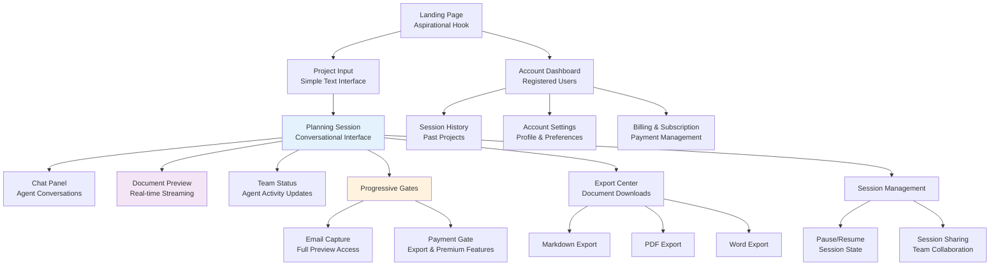
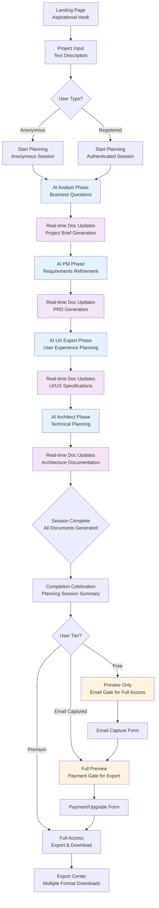
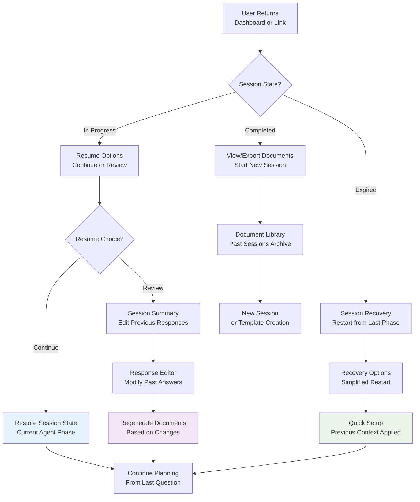

# BMAD Web UI Platform UI/UX Specification

## Introduction

This document defines the user experience goals, information architecture, user flows, and visual design specifications for BMAD Web UI Platform's user interface. It serves as the foundation for visual design and frontend development, ensuring a cohesive and user-centered experience.

### Overall UX Goals & Principles

#### Target User Personas

**Non-Technical Project Leaders:** Startup founders, product managers, and business leaders who need comprehensive project planning without technical expertise. They value clear guidance, professional deliverables, and time efficiency.

**Small Team Leaders:** Team leads in small companies who wear multiple hats and need expert-level planning support. They appreciate the "AI consulting team" experience and comprehensive documentation.

**Innovation Managers:** Corporate innovation teams who need to rapidly validate and plan new initiatives. They value the structured methodology and professional outputs for stakeholder presentation.

#### Usability Goals

- **Immediate Value Recognition:** Users understand the platform's value within 30 seconds of landing
- **Effortless Session Completion:** 85% of users complete their 45-minute planning session without abandoning
- **Intuitive AI Interaction:** Non-technical users feel comfortable conversing with AI experts without training
- **Seamless Progression:** Conversion from free to paid feels natural and value-driven rather than forced
- **Cross-Device Continuity:** Users can seamlessly continue planning sessions across devices

#### Design Principles

1. **AI Team Management Over Tool Usage** - Present the platform as managing expert consultants rather than using software
2. **Progressive Value Demonstration** - Show increasing value at each phase to drive natural conversion
3. **Real-time Anticipation** - Transform waiting time into valuable anticipation through live document generation  
4. **Expert Consultation Feel** - Every interaction should feel like working with human experts
5. **Sophisticated Simplicity** - Complex planning made approachable through thoughtful design

### Change Log

| Date | Version | Description | Author |
|------|---------|-------------|---------|
| 2025-09-08 | v1.0 | Initial UI/UX specification creation | Sally (UX Expert) |

## Information Architecture (IA)

### Site Map / Screen Inventory



### Navigation Structure

**Primary Navigation:** Context-sensitive navigation that adapts based on user state (anonymous, authenticated, in-session)
- Landing: "Start Planning" primary CTA
- Active Session: Minimal navigation to maintain focus, with discrete "Save & Exit" option
- Dashboard: Standard web app navigation with planning history and account access

**Secondary Navigation:** Session-specific controls integrated into the planning interface
- Document tabs (Project Brief, PRD, Architecture, Stories)
- Agent status indicator (current active agent)
- Progress visualization (phase completion)
- Session controls (pause, settings, help)

**Breadcrumb Strategy:** Linear progression breadcrumbs during planning sessions showing phase completion rather than traditional navigation hierarchy
- Example: "Project Input → Business Analysis → Technical Planning → Final Documents"

## User Flows

### Core Planning Session Flow

**User Goal:** Complete a comprehensive project planning session from initial idea to exportable planning documents

**Entry Points:** 
- Landing page "Start Planning" CTA
- Dashboard "New Project" button  
- Direct link sharing (future feature)

**Success Criteria:** 
- User completes 45-minute planning session
- All four document types generated (Project Brief, PRD, Architecture, User Stories)
- User successfully exports or saves planning artifacts

#### Flow Diagram



#### Edge Cases & Error Handling:
- **Session Timeout:** Auto-save every 30 seconds, graceful recovery with "Continue where you left off"
- **Agent Response Failure:** LLM failover with user notification, "Your team is regrouping, continuing shortly..."
- **Network Interruption:** Offline capability with local storage, sync when reconnected
- **Incomplete Input:** Intelligent prompting with examples, never block progression completely
- **Abandon Recovery:** Email capture for anonymous users before exit, session resume links
- **Payment Failure:** Graceful degradation, maintain session access while resolving billing
- **Document Generation Error:** Partial document preservation, specific section retry capability

**Notes:** Critical flow requires seamless real-time updates without jarring transitions. Each agent handoff must feel natural and purposeful, with clear value demonstration at each phase.

### Progressive Disclosure Conversion Flow

**User Goal:** Experience increasing platform value to justify upgrading from free to paid tier

**Entry Points:**
- Free tier usage limits reached
- Attempting premium feature access
- Completion of free planning session

**Success Criteria:**
- User understands value proposition at each tier
- Smooth conversion without losing session progress
- Clear value demonstration before payment request

#### Flow Diagram

```mermaid
graph TD
    A[Free User<br/>Planning Session] --> B[Document Preview<br/>Limited Access]
    
    B --> C{Wants Full Preview?}
    C -->|No| D[Continue Limited Experience]
    C -->|Yes| E[Email Gate<br/>Value Proposition]
    
    E --> F[Email Collection Form<br/>"Unlock Full Preview"]
    F --> G[Full Document Access<br/>All Documents Visible]
    
    G --> H[Export Attempt<br/>or Advanced Feature]
    H --> I[Payment Gate<br/>Premium Value Prop]
    
    I --> J{Upgrade Decision?}
    J -->|No| K[Continue Preview Mode<br/>Save Session]
    J -->|Yes| L[Payment Flow<br/>Stripe Integration]
    
    L --> M{Payment Success?}
    M -->|No| N[Payment Error Recovery<br/>Maintain Session Access]
    M -->|Yes| O[Premium Access Granted<br/>Full Feature Unlock]
    
    K --> K1[Session Saved<br/>Return Anytime]
    N --> I
    O --> P[Export Center<br/>Download All Documents]
    
    D --> D1[Session Limits<br/>Encourage Email Signup]
    D1 --> E
    
    style E fill:#fff3e0
    style I fill:#fff3e0
    style F fill:#e8f5e8
    style L fill:#e8f5e8
```

#### Edge Cases & Error Handling:
- **Email Validation Issues:** Alternative verification methods, social login options
- **Payment Processing Errors:** Clear error messages, alternative payment methods
- **Value Demonstration Failure:** A/B test different preview levels and messaging
- **Conversion Abandonment:** Follow-up email sequences with session resume links
- **Feature Access Confusion:** Clear tier comparison table, contextual upgrade prompts
- **Account Creation Problems:** Guest session preservation, simplified registration

### Session Resume & Management Flow

**User Goal:** Return to and continue incomplete planning sessions across devices and time

**Entry Points:**
- Dashboard session history
- Email reminder links
- Bookmarked session URLs
- Mobile device continuation

**Success Criteria:**
- Zero friction session continuation
- Full context preservation
- Cross-device session access

#### Flow Diagram



#### Edge Cases & Error Handling:
- **Context Loss:** Progressive context reconstruction, intelligent question regeneration
- **Version Conflicts:** Document version management, change history preservation
- **Cross-Device Sync Issues:** Conflict resolution UI, last-edit-wins with user notification
- **Expired Sessions:** Graceful degradation with recovery options rather than complete restart
- **Response Modification Impact:** Clear preview of how changes affect existing documents

**Notes:** Session management is critical for user retention and completion rates. The system must feel reliable and trustworthy for important planning work.

## Wireframes & Mockups

**Primary Design Files:** Figma workspace to be created - [BMAD UI/UX Design System & Prototypes]

### Key Screen Layouts

#### Planning Session Interface (Split-Screen)
**Purpose:** Core experience combining conversational AI interaction with real-time document generation

**Key Elements:**
- Left panel: Chat interface with AI agent conversations and user input
- Right panel: Live document preview with tabbed navigation (Project Brief, PRD, Architecture, Stories)  
- Top bar: Agent status indicator, session progress, minimal controls
- Bottom: Input area with smart suggestions and context help

**Interaction Notes:** Seamless real-time updates between conversation and documents. Responsive collapse to single panel on smaller screens. WebSocket-powered live streaming of document changes.

**Design File Reference:** [Figma: Planning-Interface-Desktop-v1]

#### Progressive Disclosure Modals
**Purpose:** Conversion-optimized upgrade flows that don't interrupt the planning experience

**Key Elements:**
- Overlay modal with clear value proposition
- Visual preview of locked features/content
- Simple email/payment forms with trust indicators
- "Continue Planning" option to maintain session flow

**Interaction Notes:** Non-blocking design allows planning continuation. Social proof elements and benefit callouts. Mobile-optimized payment flow.

**Design File Reference:** [Figma: Conversion-Flows-v1]

#### Landing Page
**Purpose:** Convert visitors into planning session starts with aspirational messaging

**Key Elements:**
- Hero section with "Start making your dreams a reality" hook
- Immediate project input field for quick start
- Value proposition with "AI expert team" messaging
- Trust indicators and example planning outputs

**Interaction Notes:** Minimal friction entry with progressive enrollment. Dynamic placeholder text showing example project types.

**Design File Reference:** [Figma: Landing-Page-v1]

## Component Library / Design System

**Design System Approach:** Custom design system built for AI-powered collaborative experiences, optimized for real-time content updates and progressive disclosure patterns

### Core Components

#### Real-time Document Viewer
**Purpose:** Display live-updating planning documents with smooth transitions and change highlighting

**Variants:** Full-screen mode, split-screen mode, mobile collapsed view

**States:** Loading skeleton, content streaming, fully loaded, error recovery

**Usage Guidelines:** Always show loading states during AI generation. Highlight new content additions. Provide quick navigation between document sections.

#### Conversational Interface
**Purpose:** Chat-like interface optimized for AI agent interactions and user planning input  

**Variants:** Agent question mode, user response mode, suggestion prompts

**States:** Waiting for user, AI processing, response received, error handling

**Usage Guidelines:** Clear agent identification with personas. Intelligent input suggestions. Graceful handling of long response times.

#### Agent Status Indicator
**Purpose:** Show current AI expert working on the project with engaging team management metaphor

**Variants:** Analyst mode, PM mode, UX Expert mode, Architect mode

**States:** Active working, transitioning, completed phase

**Usage Guidelines:** Reinforce "AI team" metaphor with expert titles and activity descriptions. Smooth transitions between agent phases.

#### Progress Visualization
**Purpose:** Show planning session completion without traditional progress bars

**Variants:** Phase-based milestones, document completion indicators

**States:** Current phase, completed phases, upcoming phases

**Usage Guidelines:** Focus on value delivered rather than time remaining. Celebrate phase completions with positive reinforcement.

## Branding & Style Guide

### Visual Identity
**Brand Guidelines:** Clean, professional aesthetic conveying expertise and trustworthiness. Sophisticated typography and layout reinforce "compressed expertise" positioning.

### Color Palette

| Color Type | Hex Code | Usage |
|------------|----------|-------|
| Primary | #2563eb | Primary actions, AI agent indicators, active states |
| Secondary | #7c3aed | Document highlights, premium features, accent elements |
| Accent | #06b6d4 | Success states, real-time updates, positive feedback |
| Success | #10b981 | Confirmations, completed phases, positive status |
| Warning | #f59e0b | Important notices, upgrade prompts, attention items |
| Error | #ef4444 | Errors, destructive actions, critical alerts |
| Neutral | #6b7280 | Text, borders, backgrounds, secondary information |

### Typography

#### Font Families
- **Primary:** Inter (headings, UI elements, professional clarity)
- **Secondary:** Inter (body text, consistent readability)
- **Monospace:** JetBrains Mono (code snippets, technical content)

#### Type Scale

| Element | Size | Weight | Line Height |
|---------|------|--------|-------------|
| H1 | 2.25rem | 700 | 1.2 |
| H2 | 1.875rem | 600 | 1.3 |
| H3 | 1.5rem | 600 | 1.4 |
| Body | 1rem | 400 | 1.6 |
| Small | 0.875rem | 400 | 1.5 |

### Iconography
**Icon Library:** Heroicons v2 for consistent, professional iconography

**Usage Guidelines:** Use outline style for inactive states, solid style for active/selected states. Consistent 24px size for interface elements.

### Spacing & Layout
**Grid System:** 12-column responsive grid with consistent gutters

**Spacing Scale:** 4px base unit system (4, 8, 12, 16, 24, 32, 48, 64px) for predictable layouts

## Accessibility Requirements

### Compliance Target
**Standard:** WCAG 2.1 AA compliance for inclusive design

### Key Requirements

**Visual:**
- Color contrast ratios: 4.5:1 minimum for normal text, 3:1 for large text
- Focus indicators: Visible focus states with 2px outline minimum  
- Text sizing: Scalable to 200% without horizontal scrolling

**Interaction:**
- Keyboard navigation: Full functionality accessible via keyboard only
- Screen reader support: Semantic HTML, ARIA labels, live regions for real-time updates
- Touch targets: Minimum 44px touch targets for mobile interactions

**Content:**
- Alternative text: Descriptive alt text for all images and icons
- Heading structure: Logical heading hierarchy (h1-h6) for screen readers
- Form labels: Clear, associated labels for all form inputs

### Testing Strategy
Automated accessibility testing with axe-core, manual keyboard navigation testing, screen reader testing with NVDA/VoiceOver, and user testing with accessibility consultants.

## Responsiveness Strategy

### Breakpoints

| Breakpoint | Min Width | Max Width | Target Devices |
|------------|-----------|-----------|----------------|
| Mobile | 320px | 767px | Phones, small tablets |
| Tablet | 768px | 1023px | iPads, medium tablets |
| Desktop | 1024px | 1439px | Laptops, small monitors |
| Wide | 1440px | - | Large monitors, 4K displays |

### Adaptation Patterns

**Layout Changes:** Split-screen planning interface collapses to tabbed single-column on mobile. Document preview becomes modal overlay.

**Navigation Changes:** Hamburger menu for mobile with priority-based navigation. Bottom tab bar for key actions.

**Content Priority:** Real-time document updates take precedence on small screens. Chat history becomes scrollable drawer.

**Interaction Changes:** Touch-optimized controls with larger tap targets. Swipe gestures for document navigation on mobile.

## Animation & Micro-interactions

### Motion Principles
Subtle, purposeful animations that enhance the AI team management experience. Real-time content updates use gentle fades and slides. Agent transitions include delightful loading states that reinforce the expert consultation metaphor.

### Key Animations
- **Document Streaming:** Gentle fade-in with subtle slide-up (Duration: 300ms, Easing: ease-out)
- **Agent Transitions:** Loading spinner with expert descriptions (Duration: 500ms, Easing: ease-in-out)  
- **Phase Completions:** Celebratory pulse with color transition (Duration: 400ms, Easing: bounce)
- **Form Interactions:** Input focus with border color transition (Duration: 200ms, Easing: ease-in-out)
- **Modal Presentations:** Overlay with backdrop blur (Duration: 250ms, Easing: ease-out)

## Performance Considerations

### Performance Goals
- **Page Load:** Initial page load under 3 seconds
- **Interaction Response:** UI responses within 100ms
- **Animation FPS:** Maintain 60fps for all animations

### Design Strategies
Optimize real-time updates with efficient DOM updates, lazy load document previews, implement skeleton screens during AI processing, and use progressive enhancement for advanced features.

## Next Steps

### Immediate Actions
1. Create Figma workspace with design system foundations
2. Develop high-fidelity prototypes of core planning session interface
3. Design and test progressive disclosure conversion flows
4. Build responsive component library with real-time update patterns
5. Conduct user testing of AI team management interaction paradigms

### Design Handoff Checklist
- [x] All user flows documented with edge cases
- [x] Component inventory complete with states and variants
- [x] Accessibility requirements defined with testing strategy
- [x] Responsive strategy clear with specific breakpoints
- [x] Brand guidelines incorporated with comprehensive style guide
- [x] Performance goals established with design strategies